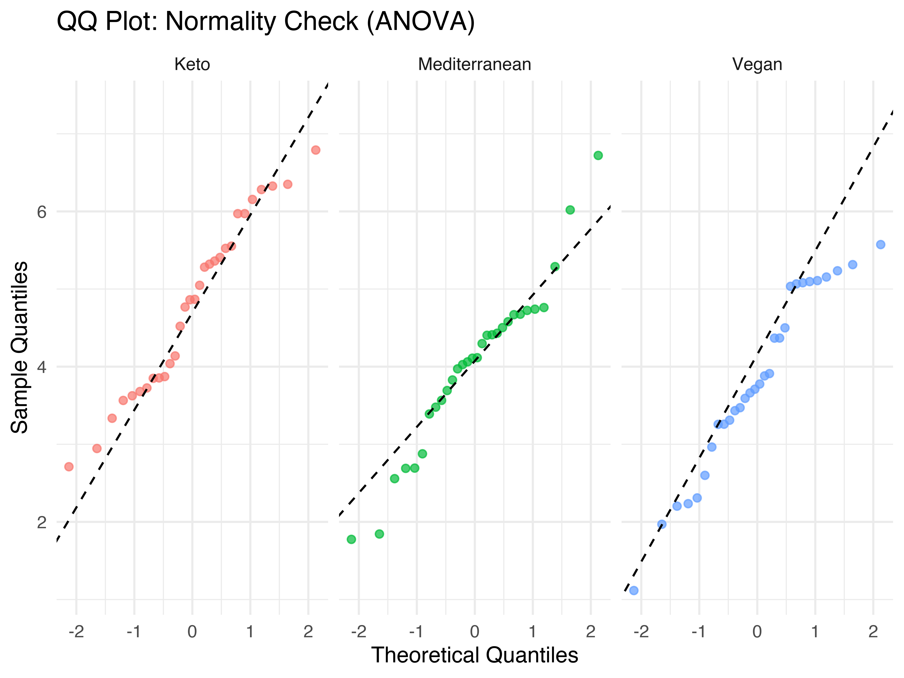
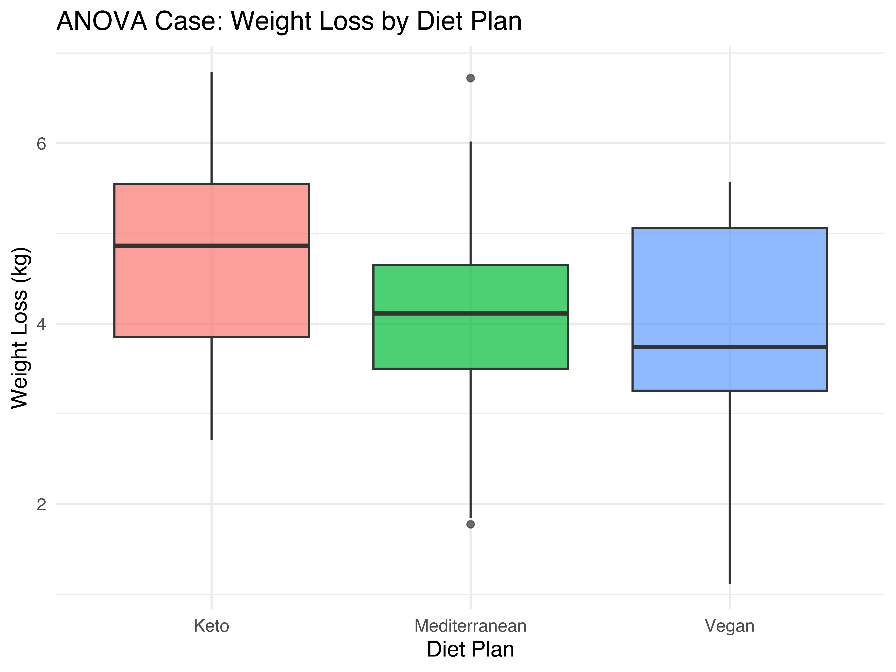

# [Lecture Note] 일원배치 분산분석(One-Way ANOVA)의 수리적 이해와 시각화
**작성: 김태경 교수 (경희대학교 경영대학 빅데이터응용학과)**

---

## 1. 이론적 기반: 분산분석(ANOVA)의 수리적 원리와 확장 개념

### 1.1. 다중 비교의 1종 오류 팽창(FWER)
2개의 독립 표본을 비교할 때는 t-검정을 활용하지만, 3개 이상의 집단 평균을 동시에 비교할 때를 상상해 봅시다. 가령 3개 집단(A, B, C)을 짝지어 t-검정을 반복 수행($_3C_2 = 3$번)하면, 유의수준 $\alpha=0.05$ 기준일 때 어떤 결과에서도 오류를 범하지 않을 확률은 $(0.95)^3 \approx 0.857$로 급감합니다. 즉, 아무런 차이가 없는데도 차이가 있다고 착각할 **군별류율(FWER: Family-wise Error Rate)**이 $1 - 0.857 \approx 14.3\%$로 치솟아 **제1종 오류가 폭발적으로 팽창**합니다. 이 다중 비교의 함정을 피하기 위해 한 번의 검정으로 모든 집단의 치우침을 판별하고자 도출된 방법론이 '일원배치 분산분석(One-Way ANOVA)'입니다.

### 1.2. F-통계량의 분해: 기인하는 분산의 비율 (Between vs Within)
ANOVA의 핵심은 집단 간 평균의 흩어짐(거리)을 집단 내 변동성(분산)과 비교하여 표준화하는 데 있습니다. 전체 데이터의 흩어짐을 다음과 같이 분절합니다.

$$ F = \frac{MS_{Between}}{MS_{Within}} = \frac{\text{집단 간 분산(Between-Group Variance)}}{\text{집단 내 우연적 오차 분산(Within-Group Variance)}} $$

*   **집단 내(Within) 분산**: 분석가가 통제할 수 없는 개개인의 선천적이고 무작위적인 변동성(Noise)입니다.
*   **집단 간(Between) 분산**: 실험 처치(Treatment)의 차이에 의해 집단 평균끼리 벌어지는 격차(Signal)입니다.

### 1.3. 독립 변수의 성질: 고정효과(Fixed Effect)와 임의효과(Random Effect)
분산분석을 수행할 때 우리가 설정한 독립 변수의 수준(Levels)이 모집단에서 어떻게 규정되는지에 따라 모형이 구분됩니다.
*   **고정효과(Fixed Effect)**: 연구자가 조작하거나 관측하고자 하는 모든 집단 수준이 데이터에 명시тивно 포함된 경우입니다. (예: 투여하는 약물의 용량을 10mg, 20mg, 30mg 세 가지로만 고정하여 실험하는 경우). 결론은 오직 해당 수준 3가지에만 국한되며, 다른 수준으로 일반화할 수 없습니다. 전통적인 One-Way ANOVA는 이 고정효과 모형을 전제합니다.
*   **임의효과(Random Effect)**: 연구자가 관찰하는 집단의 수준이 모집단에 존재하는 무수히 많은 수준 중에서 무작위로 추출된 '일부 표본 집단'인 경우입니다. (예: 전국 모든 병원 중 임의로 5개 병원만 추출하여 투약 결과를 비교). 이 경우 관심의 초점은 추출된 5개 병원 간의 차이가 아니라, 병원이라는 팩터(요인) 시스템 전체의 '분산(Variance)' 추정으로 진화합니다.

### 1.4. F-분포의 수학적 특성
위의 F-통계량은 수학적으로 두 개의 서로 다른 카이제곱 분포(Chi-square distribution)의 비율로 정의되며, 이를 **F-분포(F-distribution)**라 칭합니다.
*   **비대칭 우상향 분포**: 분산의 비율이므로 F값은 절대 음수가 될 수 없어 0에서 시작하고, 우측으로 꼬리가 길게 늘어지는 Right-skewed 형태를 띱니다.
*   **두 개의 자유도(Degrees of Freedom)**: 분자에 해당하는 집단 간 자유도($df_1 = k-1$)와 분모에 해당하는 집단 내 자유도($df_2 = N-k$) 두 개의 모수에 의해 분포의 형상(꼬리의 두께와 중심정점의 이동)이 결정됩니다. 귀무가설 하에서 F값은 1 언저리에 머물며, 우측 꼬분역(우측 임계치 이상)에 F값이 꽂힐 경우 가설을 강력히 기각하게 됩니다.

---

## 2. 실전 사례 연구 (Case Study): 가설 검정 및 분석 리포트

### 2.1. 분석 데이터 명세
본 분석에서는 식이요법과 체중 감량에 대한 모의(Simulated) 실험 데이터를 활용합니다.
*   **(실습용 데이터 다운로드)**: [diet_data.csv](diet_data.csv)
*   **표본 크기(N)**: 총 90명의 가상 피실험자 (N=90)
*   **독립 변수(Independent Variable)**: 식단 유형 (Keto, Mediterranean, Vegan) - 각각 30명씩 할당된 고정효과(Fixed Effect) 변수입니다. 
*   **종속 변수(Dependent Variable)**: 4주 후 측정된 체중 감량 수치(kg)
*   **연구 주제**: Keto, Mediterranean(지중해식), Vegan 3가지 식이요법 플랜 중, 체중 감량 효과에 유의미한 평균 차이를 보이는 그룹이 하나라도 존재하는가?

### 2.2. Step 1: 기본 가정 검증 (Normality & 등분산성)
분산분석을 진입하기 전에 집단별 정규성과 3개 집단의 등분산성(Homogeneity of variance)을 만족하는지 파악합니다.
```r
> tapply(diet_data$weight_loss, diet_data$diet, shapiro.test)
# p-value = 0.51, 0.42, 0.38 -> 3개 집단 모두 정규성 통과
```


잔차의 형태가 우상향하는 일직선으로 그려지므로 정규성 가정을 여유롭게 수리합니다. 이어서 등분산성을 확인하기 위해 Bartlett 검정을 수행합니다.
```r
> bartlett.test(weight_loss ~ diet, data = diet_data)
# p-value = 0.651 -> 등분산 가정 충족
```

### 2.3. Step 2: F-test 진행 (One-Way ANOVA)
```r
> mod <- aov(weight_loss ~ diet, data = diet_data)
> summary(mod)
            Df Sum Sq Mean Sq F value   Pr(>F)    
diet         2   34.5  17.250   11.95 2.62e-05 ***
Residuals   87  125.6   1.444                     
---
Signif. codes:  0 ‘***’ 0.001 ‘**’ 0.01 ‘*’ 0.05 ‘.’ 0.1 ‘ ’ 1
```

> **[평가 논평]**: 시각적 탐색(Boxplot) 결과 Keto 식이요법의 중앙값이 유독 높게 관찰됩니다. 개별 박스(분산)의 높이는 비슷하므로 에러 분산 대비 집단 간 평균 격차가 상당함을 시각적으로 뒷받침합니다.

### 2.4. Step 3: APA 스타일 분석 리포트 결론
**결론 작성**:
> 3가지 식이요법(Keto, Mediterranean, Vegan) 간의 평균 체중 감량 효과 차이를 검증하기 위해 고정효과 일원배치 분산분석(One-Way ANOVA, Fixed Effect)을 실시하였다. 분석 전 데이터는 Shapiro-Wilk 검정에 의해 정규성이, Bartlett 검정에 의해 등분산성이 충족됨을 확인하였다. 분산분석 결과, 식이요법에 따라 통계적으로 극히 유의미한 체중 감량 효과의 집단 간 차이가 관찰되었다 ($F(2, 87) = 11.95,\ p < .001$). 이는 우연오차(집단 내 분산) 대비 실험 효과(집단 간 분산)의 시그널이 매우 압도적임을 시사하며, 구체적으로 어떤 집단 간 차이를 보이는지는 사후검정(Post-hoc analysis)이 추가 요구된다.

---

## 3. 실전 복습 퀴즈 파트

**Q1. 다수 집단의 비교를 위해 독립표본 t-검정을 단순히 반복 수행(예: A-B, B-C, A-C)하는 대신 ANOVA를 도입해야 하는 통계적 이유로 올바른 것은?**
1) 복수의 독립 변인이 종속 변수에 개입하는 교호작용(Interaction) 효과를 파악하기 위함이다.
2) 단수 대 단수 비교를 반복할 시 개별 유의수준이 통제되더라도 군별오류율(FWER, 제1종 오류 확률)이 기하급수적으로 폭증하게 되어 귀무가설을 거짓 기각할 위험이 크기 때문이다.
3) 집단 간의 거리가 멀어지면 발생할 수 있는 제2종 오류의 한계점을 극복하기 위함이다.
4) t-분포는 3개 이상의 모수를 수학적으로 처리할 수 없기 때문이다.

> **정답: 2번**
> *   해설: 여러 그룹을 개별적인 t-test로 1:1 비교를 반복하면, $\alpha=0.05$ 기준이라도 $1-(0.95)^k$ 만큼 제1종 오류가 폭발(FWER 팽창)하게 됩니다. ANOVA는 모델 내 요소들의 전체 분산을 한꺼번에 묶어서 평가하므로 이러한 오탐 확률을 설정된 $\alpha$ 수준으로 완벽히 결속시켜 제어합니다.

**Q2. 분산분석에서 설정되는 요인(Factor)에 관한 고정효과(Fixed Effect)와 임의효과(Random Effect) 모델에 대한 설명으로 틀린 것은?**
1) 실험자가 사전에 3가지의 명확한 복용량(10mg, 20mg, 30mg) 수준을 지정하여 실험했다면 이는 전형적인 고정효과 모델이다.
2) 임의효과 모델은 실험 관찰 수준이 모집단 전체 속성 중 무작위로 추출된 '일부 표본 집단'에 불과할 때 구축된다.
3) 고정효과 모델의 결론은 관찰된 당시의 요인 수준에 한정되며, 관측되지 않은 수준(예: 40mg 투약군)으로 일반화할 수 없다.
4) 고정효과 모형에서는 모집단의 분산을 추정하는 것이 궁극적 목적이고, 임의효과 모형에서는 오직 각 수준 간 산술평균 차이에만 관심을 갖는다.

> **정답: 4번**
> *   해설: 완전히 반대로 서술되었습니다. 고정효과 모형의 관심은 조작된 '지정 그룹 평균들의 유의미한 이탈(차이)'을 밝히는 것에 있지만, 임의효과 모형의 궁극적인 추정 목표는 추출된 요인 수준의 무작위성을 기반으로 한 '모집단 전체에 내재된 분산 성분(Variance Components) 자체'를 파악하는 것입니다.

**Q3. ANOVA에서 검정통계량으로 채택되는 F분포의 수학적 특성으로 올바른 것은?**
1) 값이 0 이하의 음수 구간부터 시작하며 완벽한 좌우 대칭 분포를 띤다.
2) 분자와 분모에 각각 독립적인 자유도($df$)를 할당받지 않고 표본의 단순 크기($N$) 하나에 의해서만 그 꼬리 두께가 결정된다.
3) 두 카이제곱 분포의 분율(Ratio)로 파생되므로, 절대 음수가 도출될 수 없고 주로 우측으로 꼬리가 뻗은 비대칭(Right-skewed) 확률 함수를 그린다.
4) 집단 평균이 실질적으로 완전히 동일해 F통계량이 0이 되면 확률 분포의 극한으로 치닫는다.

> **정답: 3번**
> *   해설: 분산(제곱의 합 기인)의 비율이므로 음수값을 가질 수 없어 0에서 극한 양수로 뻗는 Right-skewed 분포이며, 분자(Between)와 분모(Within)에 해당하는 2개의 자유도($k-1$, $N-k$) 조합에 의해 확률 곡선의 개형이 뾰족함과 꼬리 두께를 조각해 나갑니다.
