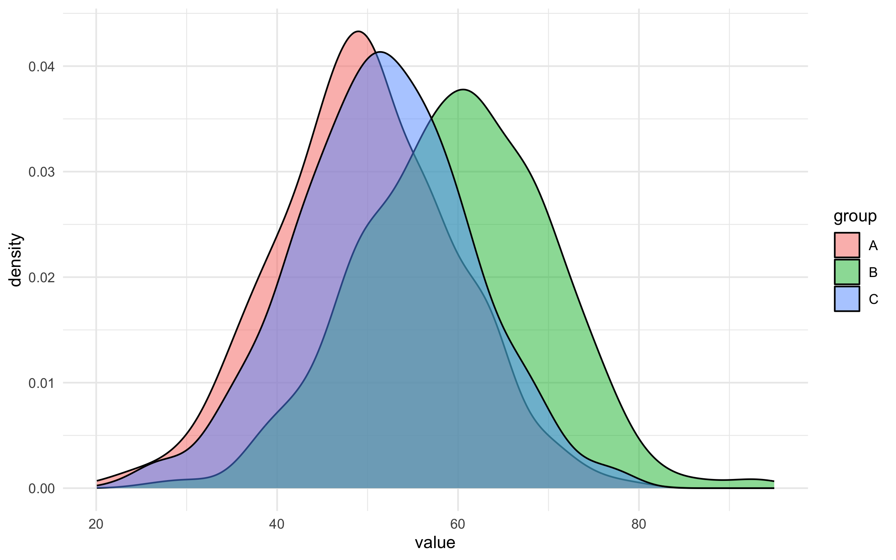

#  [Lecture Note] 일원배치 분산분석(One-Way ANOVA) 완벽 가이드

## 👨‍🏫 1. [Stat Professor] F-분포의 수학적 원리 (Between vs Within)
ANOVA는 t-test를 3번 이상 무턱대고 반복할 때 발생하는 1종 오류의 폭발적 증가를 방지하기 위해 고안되었습니다.
평균들이 얼마나 흩어졌는지 알기 위해 '단일 분산(Variance)'의 개념으로 쪼개어 검증합니다.
$$ F = \frac{\text{Between-Group Variance (집단 간 분산)}}{\text{Within-Group Variance (집단 내 우연적 오차)}} $$
그룹 내부 데이터의 노이즈보다, 각 집단 평균들 사이의 실질적인 격차가 훨씬 크다면 F값은 치솟고 귀무가설(모든 평균은 같다)은 박살납니다.

## 🎨 2. [R Visualizer] 3개 집단의 폭포상 분포
집단 내 분산(곡선의 넓이)이 작고, 집단 간 거리(봉우리의 간격)가 멀수록 ANOVA는 유의미해집니다.


##  3. [R Explainer] `aov()` 코드 해석기
```r
mod <- aov(value ~ group, data = df)
summary(mod)
```
** 해설**: `aov()` 함수는 t.test의 그룹 확장판입니다! `종속변수(수치) ~ 독립변수(집단)` 포맷에 우겨넣으면 끝이며, `summary()`를 통해 F-value와 그에 따른 P-value 성적표를 출력합니다.

##  4. [Quiz Maker] 실전 복습 퀴즈
**Q. ANOVA에서 산출된 F통계량에 대한 올바른 해석은 무엇일까요?**
1) F값이 엄청나게 크다면, 분석에 포함된 모든 집단끼리 사이좋게 각각 전부 다르다는 뜻이다.
2) F값이 1에 한없이 가깝다면, 집단들 간의 차이가 노이즈 수준의 차이와 별 다를 바 없이 똑같다는 뜻이므로 유의미하지 않다. 
3) F-test 결과로 p<0.05가 도출되었다면 사후분석을 굳이 진행할 필요가 없다.
4) 집단 내 분산(Within)이 커지면 커질수록 F값은 폭증한다.

> ** 정답: 2번**
> * 해설: F분율 공식 구조상 Between과 Within이 비슷하면 값은 1에 수렴하며 이는 통계적 유의성이 없음을 뜻합니다. (1번의 경우 적어도 하나만 달라도 F값은 뜨기 때문에 모두가 다르다고 확신할 수 없으며, 그렇기 때문에 사후분석이 강제로 필요합니다.)
