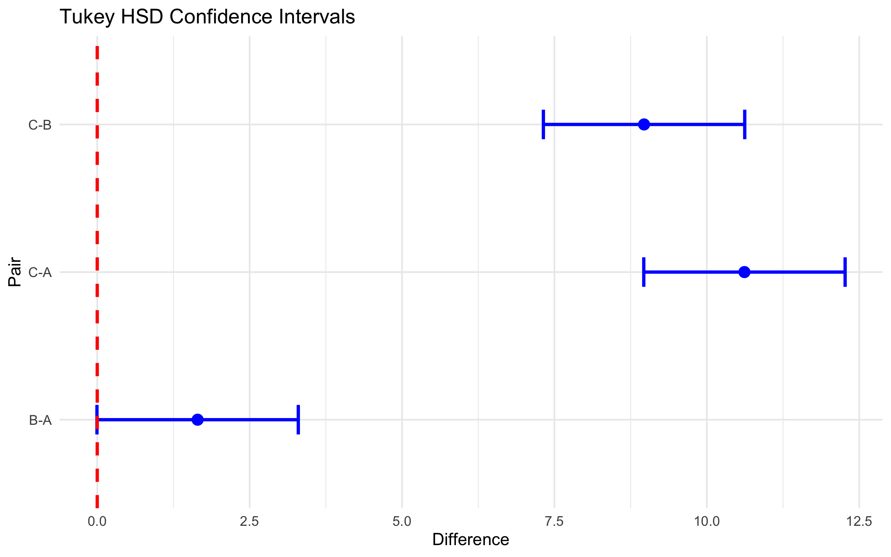

#  [Lecture Note] 분산분석 사후검정(Post-Hoc Analysis)과 패널티의 미학

## 👨‍🏫 1. [Stat Professor] FWER의 위협과 패널티 교정기법
ANOVA의 치명적 단점은 "적어도 한 집단은 평균이 다르다"라는 두리뭉실한 대답만 던져준다는 것입니다. 결국 실무진은 집단을 1:1로 쪼개어 모두 다 t-test로 비교(다중 검정)하는 막노동을 해야 합니다.
하지만 비교 횟수가 늘어날수록, 유의수준(alpha)이 누적 팽창하여 "안 다른데 다르다고 거짓말칠 확률(Type 1 Error, FWER)"이 무섭게 치솟습니다. 이를 엄격하게 관리하기 위해 p-value의 커트라인을 잔혹하게 깎아버리는 조치가 **Tukey HSD**나 **Bonferroni** 사후 교정법입니다.

## 🎨 2. [R Visualizer] 신뢰구간이 0(Zero)을 머금고 있는가?
아래의 Tukey 사후 검증 차트의 X축은 쌍별 평균값의 진짜 차이입니다. 
파란 선(신뢰구간)이 세로 빨간색 점선(0의 위치, 즉 차이가 없음을 뜻함)을 관통해서 포함하고 있다면 "차이 없음", 0을 넘어가서 허공에 위치한다면 "유의미한 확실한 차이 있음!"입니다.


##  3. [R Explainer] `TukeyHSD()` 해설
```r
thsd <- TukeyHSD(aov_model)
```
** 해설**: 이미 만들어둔 뭉텅이 모델박스 `aov_model`을 `TukeyHSD` 함수라는 분쇄기에 집어넣기만 하면 됩니다. 출력된 결과창 우측 끝의 `p adj` 열을 보시면, 살벌한 패널티를 얻어맞아 깐깐해진 진짜 p-value가 위풍당당하게 렌더링되어 있습니다!

##  4. [Quiz Maker] 실전 복습 퀴즈
**Q. 다음 중 다중 비교 사후검정과 1종 오류(Type 1 Error)의 역학 관계를 가장 잘 이해한 것은?**
1) 비교하는 쌍(Pairs)이 기하급수적으로 늘어날수록 가짜 양성(거짓말) 확률이 치솟으므로, 사후 분석을 통해 p-value 컷오프를 더 보수적으로 패널티 교정한다.
2) 비교 횟수와 상관없이 유의수준 5%는 영원불변의 진리다.
3) 사후검정은 p-value를 일부러 뻥튀기시켜 기각될 확률을 높여주는 자비로운 툴이다.

> ** 정답: 1번**
> * 해설: 본페로니나 튜키 교정의 핵심은 1종 오류 범람(Family-wise error rate)을 통제하기 위해 각각의 개별 검정의 통과 허들을 잔혹할만치 높게 조이는 통계학자들의 엄밀한 방어 기제입니다.
