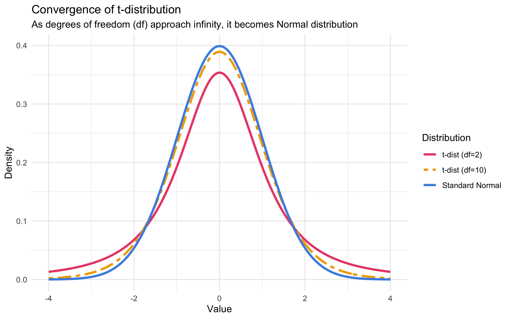
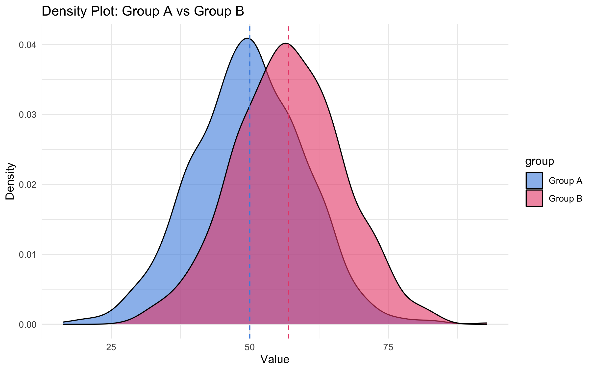
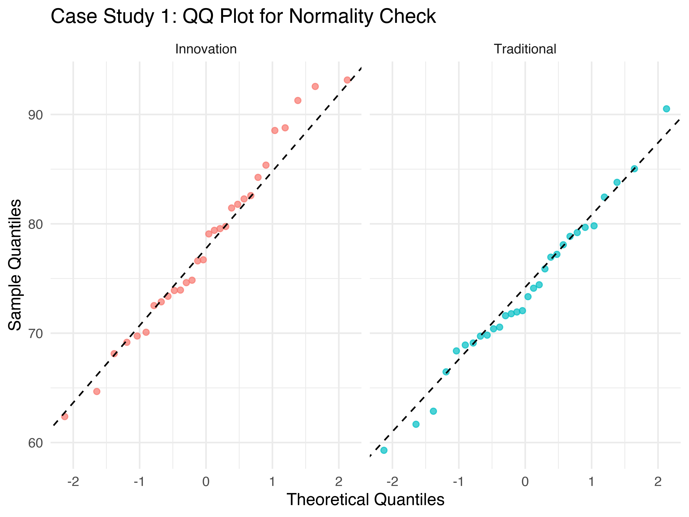
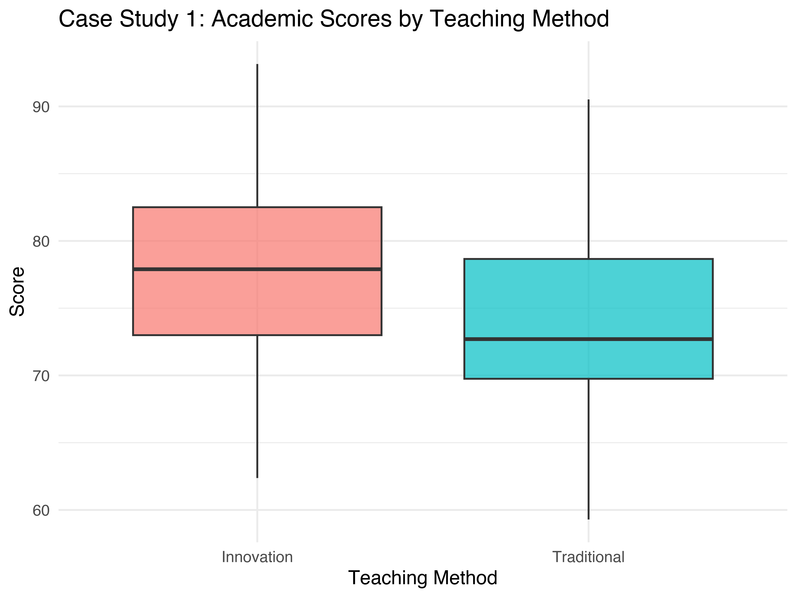
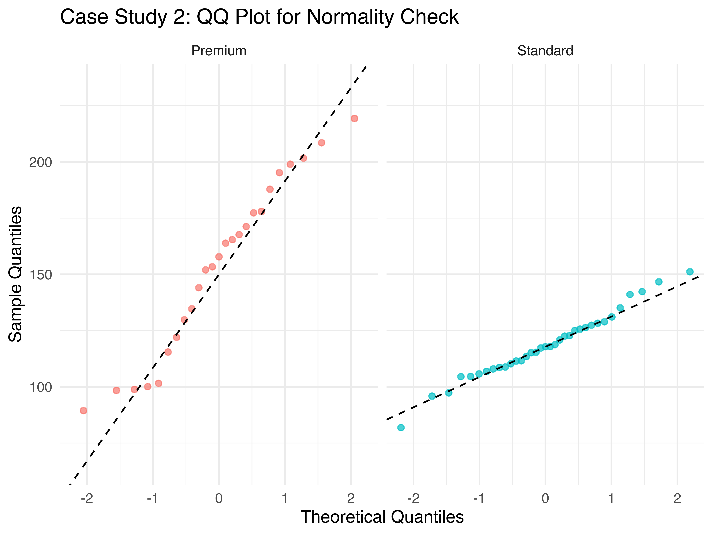
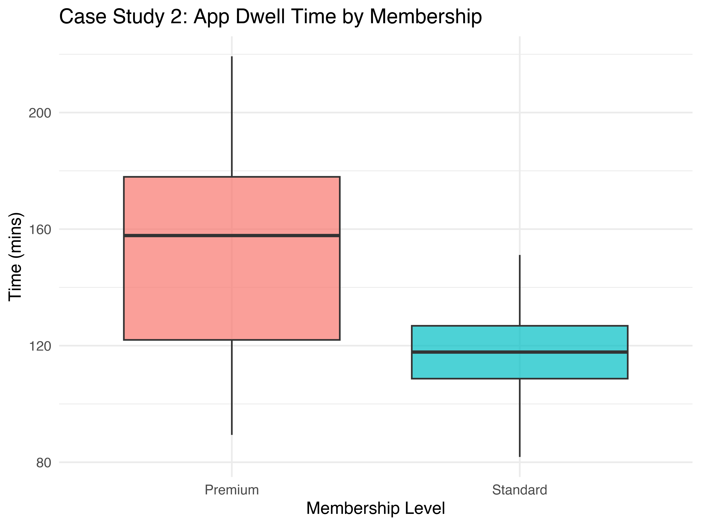

#  [Lecture Note] t-분포 및 t-검정(t-test)의 수리적 이해와 시각화
**작성: 김태경 교수 (경희대학교 경영대학 빅데이터응용학과)**

---

## 1. 이론적 기반: t-분포의 도출 및 검정통계량의 해석

### 1.1. 모분산 미지와 t-분포의 활용
모분산($\sigma^2$)이 알려진 경우, 가설 검정은 표준정규분포를 따르는 Z-통계량을 통해 수행할 수 있습니다. 그러나 현실의 데이터 분석 환경에서는 모분산을 사전에 알 수 없는 경우가 대부분입니다. 따라서 이를 표본분산($s^2$)으로 대체하여 추정해야 하며, 이 과정에서 발생하는 추가적인 추정의 변동성(불확실성)으로 인해 검정통계량은 더 이상 정규분포를 엄밀하게 따르지 않게 됩니다.

$$ t = \frac{\bar{X} - \mu}{s / \sqrt{n}} $$

> **[개념 확장] t-통계량의 수리적 해석 (Signal-to-Noise Ratio)**
> 위 수식에서 분자($\bar{X} - \mu$)는 관측된 '집단 간의 평균 차이(Signal)'를, 분모($s / \sqrt{n}$)는 표본 추출에 기인한 '표준오차(Noise)'를 의미합니다. 즉, t-통계량은 우연히 발생할 수 있는 데이터의 내재적 변동성보다 관측된 집단 간 차이가 상대적으로 얼마나 큰지를 나타내는 척도입니다. 이 비율의 절댓값이 클수록 관측된 현상이 우연일 확률(p-value)은 0에 수렴하게 됩니다.

결과적으로 이 통계량은 양쪽 극단 영역(Tail)의 밀도가 정규분포보다 한층 두꺼운(Heavy-tailed) **Student's t-분포**를 따릅니다. 표본의 크기($n$)가 작을수록 분산 추정의 과소/과대적합 오차가 커지므로, 제1종 오류 위험을 통제하기 위해 양 끝단의 확률 면적을 더 확보하도록 보조하는 것이 t-분포의 수리적 목적입니다.

### 1.2. 자유도(Degrees of Freedom)와 측도 분포의 수렴성

t-분포의 구조적 형태를 결정짓는 핵심 모수는 **자유도(Degrees of Freedom, $df$)**입니다. 

> **자유도에 대한 학술적·직관적 이해**
> *   **엄밀한 수리적 정의**: 통계량을 추정할 때 수학적으로 '독립적인 변화가 허용되는 관측치의 개수'를 뜻합니다. 표본분산을 산출하기 위해서는 편차($X_i - \bar{X}$)의 제곱식을 사용하는데, 편차의 총합은 필연적으로 0이 되어야 한다는 제약 조건($\sum(X_i - \bar{X}) = 0$) 1개가 발생합니다. 따라서 $n$개의 표본 중 마지막 1개는 나머지 $n-1$개의 합에 의해 종속적으로 그 값이 고정되며, 실제 자유롭게 움직여 분산 산출에 기여하는 독립적 정보의 크기는 $n-1$이 됩니다.
> *   **직관적 구조의 해석**: 이를 '선택의 독립성' 차원에서 이해할 수 있습니다. 예를 들어, 7일 동안 매일 다른 7개의 식단을 배치한다고 할 때, 6일간은 남은 식단 범위 안에서 자유롭게 종류를 선택할 수 있으나, 마지막 7일째에는 이미 소진되지 않고 남은 1개의 식단으로 강제 배정됩니다. 마찬가지로 표본평균이라는 모평균 추정치를 산출하며 제약 하나가 선결되었으므로, 데이터의 변동성을 논할 때 부여 가능한 총량의 차원은 $n-1$이 됩니다.

표본 수가 제약되어 자유도가 낮을 경우(예: $df=2$, 붉은색 실선), 극단적인 오차값 발현 확률을 보정하기 위해 분포 양 끝단 밀도가 정규분포 대비 다소 상향 분포합니다(Heavy-tailed). 반면, 데이터가 누적되어 자유도가 확장될수록($df=10$, 노란색 점선), 통계적 추정의 오차가 소멸되며 분포 꼬리의 두께가 감쇠하고 동시에 평균 부근의 중심부 밀도가 강화됩니다. 최종적으로 표본의 크기와 자유도가 무한대에 이르면 t-분포 곡선은 수학적으로 **표준정규분포(Standard Normal Distribution)**에 한 치의 오차 없이 수렴(Convergence)하게 됩니다.



### 1.3. P-value의 통계적 정의 및 오개념 극복
P-value를 "대립가설이 틀릴 확률" 내지는 "귀무가설이 참일 확률"로 단정하는 것은 통계학적으로 가장 빈번히 일어나는 심각한 해석의 오류입니다. 

*   **올바른 정의**: 비교 집단 간에 유의미한 차이가 개입되지 않았다는 **귀무가설($H_0$)이 참이라는 엄격한 가정하에**, 현재 관측된 샘플 데이터 혹은 그보다 **더 극단적인 결과가 무작위적 우연에 의해 관찰될 수 있는 조건부 확률** $P(\text{Data} | H_0)$을 의미합니다.
*   **논리적 전개**: 산출된 p-value가 연구 설계 시 정해둔 유의수준(예: $\alpha=0.05$) 미만으로 도출된다면, 귀무가설의 가정하에서는 작금의 데이터가 출현할 가능성이 지극히 희박함을 강력히 시사합니다. 따라서 검정 판단의 보수적 기준에 의거하여 귀무가설을 기각하고 연구자의 대립가설을 채택하는 결론에 도달합니다.

---

## 2. 표본 집단 간 분포의 시각적 검증 (Density Plot)

하단의 그래프는 가상의 두 독립 표본 집단(Group A, Group B) 간의 확률밀도(Density) 함수를 도식화한 모형입니다. 

> **[논평] 모멘트(Moment) 관점에서의 시각적 분포 비교와 그 통계적 수의(隨意)**
> 통계적 관점에서 집단의 분포를 시각적으로 대조한다는 것은, 단순히 기댓값(위치)을 견주어 보는 것을 넘어 분포를 구성하는 근본적인 모멘트(Moments) 특성을 종합적으로 평가하는 수리적 과정입니다. 
> *   **1차 적률(1st Moment, 평균 $\mu$)**: 분포 전체 집단의 '위치(Location)'를 결정합니다. 아래 그래프에 표시된 수직 점선(평균선) 간의 공간적 거리가 바로 집단 간 1차 적률 상이성을 도해한 것입니다.
> *   **2차 중심적률(2nd Central Moment, 분산 $\sigma^2$ 및 표준편차)**: 분포의 '형태(Shape)' 및 산포 영역(Scale)을 확정합니다. 각 밀도 분포가 좌우로 넓게 퍼져 형성된 폭(너비)의 스케일링이 바로 각 집단 내적 변동성을 내포하는 2차 적률의 가시화 증거입니다.
> 
> 결과적 관점에서 t-검정과 분산분석의 태생적 본질은 **"1차 적률(평균의 이격)의 차이가 2차 적률(분산의 퍼짐)에 대비하여 유의미하게 압도적인가?(Signal-to-Noise 구조)"**를 증명하는 논리적 귀결점이며, 본 밀도 그래프는 두 적률 간의 상대적 경쟁 관계를 즉각적으로 체감할 수 있는 심미적이자 수리적인 척도가 됩니다.



> **[학술 여담] 통계적 역학: 물리학 체계의 모멘트(Moment)와 통계적 분포 밀도의 접점**
> 통계학의 '적률(Moment)' 개념은 본래 물리학과 역학에서 활용되는 '모멘트(회전력 및 지레의 원리)'의 수리적 사상을 수용한 결과물입니다. 물리학의 모멘트가 기점(받침점)에서부터 떨어진 '거리'와 해당 물체의 '질량'을 연산하여 도출되듯, 통계학의 모멘트 역시 기준 기댓값($\mu$)에서 확률변수($X$)까지 이격된 '편차(거리)'와 그 지점에 할당된 '확률 밀도(질량)'의 적분을 통해 정의됩니다.
> *   **1차 적률(평균)**은 수리물리학의 **무게중심(Center of mass)** 공리에 해당합니다. 즉, 데이터의 확률 질량이 어느 한쪽으로 쏠리지 않고 정확하게 평형을 이루는 작용점을 찾아내는 수학적 증명입니다.
> *   **2차 중심적률(분산)**은 동역학의 **회전관성(Moment of inertia)**과 동일한 체계를 갖습니다. 기준축(평균)으로부터 확률 질량이 말단으로 흩어질수록 역학적 관성이 극대화되는 원리와 동치로서, 중심으로부터 이탈해 방사된 데이터들의 산포(퍼짐 형질)를 수치화한 것입니다.
> 결국 데이터 집단의 분포를 적률로 판관한다는 것은, 정보의 군집이 내재한 '무게중심'과 '관성 저항력'의 역학적 원리를 수리적으로 규명해내는 학술 과정이라 평할 수 있습니다.

---

## 3. 시각화 구현을 위한 R Code Review

본 시각화 산출물을 도출하기 위해 사용된 R 코드는 다음과 같습니다. 학습 목적상 각 분석 파이프라인의 구문적 목적을 확인하시기 바랍니다.

```r
library(ggplot2)

# 1. 재현성을 확보하기 위한 시드(Seed) 할당 및 모의 데이터 난수 생성
set.seed(42)
gA <- data.frame(value = rnorm(1000, mean = 50, sd = 10), group = "Group A")
gB <- data.frame(value = rnorm(1000, mean = 57, sd = 10), group = "Group B")
df <- rbind(gA, gB)
```
*   **분석 포인트**: `rnorm` 함수를 통해 모평균과 모표준편차가 일정 부분 통제된 각각 1,000건의 정규 분포 난수 배열을 생성하였습니다. 집단 간 연속적 비교 렌더링에 필요한 형태를 갖추기 위하여, `rbind` 결합 함수를 이용해 해당 정보를 단일 데이터 프레임 체계로 병합 구성하였습니다.

```r
# 2. 커널 밀도 추정(Kernel Density Estimation) 기반의 중첩 지표 렌더링
ggplot(df, aes(x = value, fill = group)) + 
  geom_density(alpha = 0.6) + 
  geom_vline(xintercept = 50, linetype = "dashed", color = "#4A90E2") + 
  geom_vline(xintercept = 57, linetype = "dashed", color = "#E94E77") + 
  theme_minimal() + 
  labs(title = "Density Plot: Group A vs Group B", x = "Value", y = "Density")
```
*   **분석 포인트**:
    *   `geom_density()`를 활용하여 분포 밀도를 평활화하여 가시화하였습니다. `alpha` 파라미터를 통해 색상의 불투명도를 하향 조절함으로써, 두 집단 간의 공통 중첩 확률 영역(Overlap area)을 직관적으로 확인토록 설계되었습니다.
    *   수직 이등분선의 경우, `geom_vline()`을 활용하여 각 집단의 평균 중심축($\bar{X_A}, \bar{X_B}$)에 위치를 특정하였으며 이를 통해 중심 위치 간의 상대적 거리 이격을 명확히 표시하였습니다.

---

## 4. 핵심 개념 평가 (Assessment)

### Quiz 1: t-분포와 자유도의 관계성 분석
**Q. 다음 중 t-분포 이면의 수리적 특성에 대한 설명으로 가장 적절무결한 것은 무엇입니까?**
1) 표본 관측의 크기가 축소될수록 추정된 t-분포 중심 영역의 밀도가 오히려 상승하여 분포 첨도가 뾰족한 형태를 취하게 된다.
2) t-분포는 모집단의 분산을 정확히 추론할 수 있는 엄밀한 환경에서 주로 활용되는 최적의 대표 확률분포이다.
3) 표본의 크기(자유도)가 증가할수록 t-분포의 양 극단 꼬리의 두께 비중이 지속 감소하며, 궁극적으로 표준정규분포(Z-분포) 곡선에 수학적으로 완전 수렴하게 된다.
4) 관측치의 수가 10개 미만인 극소표본의 경우에는 모수적 정규성 여부나 왜도(Skewness)와 철저히 무관하게 기본적으로 t-검정을 일괄 강제 적용해야 한다.

---
** 정답: 3번**
*   **해설**:
    *   **정답 (3번)**: 이론적으로 자유도($\lim \limits_{n \to \infty} n-1$)가 무한정 커지면 표본분산이 사실상 모분산에 확정적으로 근사하게 되므로 t-분포는 표준정규분포 체계로 완벽하게 융합됩니다.
    *   **1번 대안**: 표본의 관측 수가 작을수록 모수 추정의 과분산 불확실성이 증대되어 분포 중심의 피크(Peak)는 하락하고, 양 끝단 꼬리(Tail) 영역의 면적 비율이 늘어납니다 (Heavy-tailed distribution).
    *   **2번 대안**: 모분산을 확정적으로 아는 경우 분산의 구조적 불확실성이 내재하지 않으므로 곧바로 표준정규분포 기반의 Z-검정을 차용하는 것이 정석입니다.
    *   **4번 대안**: t-검정은 모수통계량으로서 원 데이터 분포의 강한 정규성(Normality)을 전제합니다. 소표본이 유의미한 구조적 비대칭성이나 극단적 변동을 보일 시에는 비모수적 접근 방법(e.g. Mann-Whitney U test)으로 조향하여야 안전합니다.

### Quiz 2: P-value의 학술적 검정 원리
**Q. 대조군과 실험군 간 t-검정을 수행한 결과 집단 간 평균 차이의 p-value가 0.01로 산출되었습니다. 해당 결과의 통계적 의의를 가장 원칙적으로 풀어낸 해석은 무엇입니까?**
1) 연구설계 시에 도출된 대립가설의 명제가 틀렸을 사후적 확률이 통계적으로 정확히 1%임을 의미한다.
2) 두 집단의 모평균 수치의 간격이 절대적 평가 척도 단위에서 0.01 포인트만큼 벌어져 실재함을 시사한다.
3) 임상적으로 두 집단 특성에 어떠한 차이점도 발생하지 않았다는 귀무가설이 절대적 진실일 확률이 1%임을 나타낸다.
4) 귀무가설이 완벽히 참이라는 가정하에서, 당장 추출한 현재의 표본 효과 크기 또는 그 이상의 극단적인 변동치가 무작위 난수 오차에 의해 목격될 연속 조건부 확률이 1%임을 일컫는다.

---
** 정답: 4번**
*   **해설**:
    *   **정답 (4번)**: P-value는 전적으로 조건부 확률 $P(\text{Data} \ge \text{Observation} | H_0)$의 형식을 갖춥니다. 즉, 귀무가설이라는 전제의 틀 내부에서 현 표본 수준의 이상(Anomaly)이 임의적으로 관측될 확률이 고작 1%인지라 임계 영역에 당면한 바, 기존 가설(귀무가설)을 기각 채택한다는 합리론의 근거입니다.
    *   **1번 & 3번 대안**: p-value는 "검정될 대상 가설($H_0$ or $H_1$) 자체가 참 또는 거짓일 베이지안적 사후확률"을 논하는 기준치가 아닙니다. 현장 분석에서 가장 뿌리 깊게 만연한 수리적 왜곡 해석입니다.
    *   **2번 대안**: p-value의 값은 가설의 인과적 차이 발생 가능 여부를 거르는 체(Sieve) 역할만 할 뿐, 실측된 연구 데이터에 따른 모평균의 절댓값 효과 크기(Effect Size)를 수치 단위로 담보하지 못합니다.

### Quiz 3: 검정통계량 통제 지수의 구조
**Q. 통계 모델링 검증 결과 도출된 기준 검정통계량(t-statistic)이 `-12.5`로 나타났습니다. 이 검정 결과 수치에 대한 학문적 논지로 가장 타당성이 높은 것은?**
1) 부호 산출 과정 상 통계량이 음수(-) 값으로 하락하였으므로, 전반적인 실험 설계 구조나 데이터 매핑 지표상 결함 소지가 있음을 암시한다.
2) 통계량의 절댓값이 음수로 크므로 기존 가설 범위의 기각역 경계로 진입하지 못해 비유의적인 도출 확률에 수렴한다.
3) 우연적 요소인 집단 내 발생 데이터 오차(Noise)에 비해, 설계된 집단 간 평균 산포의 차이(Signal) 지표 강도가 무려 12.5배 뚜렷함을 나타내며 매우 확고한 통계적 유의성을 지닌다.
4) 각 실험 집단 간 분산 비율을 대입하였을 때, 비교 그룹(A)의 변동 폭이 대조 부문 그룹(B) 대비 오차 없이 정밀하게 12.5배 단위로 편향되었다는 것을 확정 지을 수 있다.

---
** 정답: 3번**
*   **해설**:
    *   **정답 (3번)**: $t = \frac{\text{그룹 간 차이(Signal)}}{\text{표준오차(Noise)}}$ 식에 의해 도출됩니다. 산정된 비율의 분자가 분모에 비해 약 12.5배 상회한다는 것은 통계적 무작위 오차와 결을 달리하는 집단 간 실제적 효과 차이('Signal')가 강력하게 구동하고 있음을 방증합니다. 통계량 차원이 거대화될수록 이에 상응하는 유의확률은 단적으로 거의 0에 한없이 집중 수렴하게 됩니다.
    *   **1번 대안**: 통계 결과 앞 음수 표시(-)의 등장은 단편적으로 앞선 타겟 데이터 변인의 평균이 비교 대상의 평균 수치보다 단순히 수학적으로 적었다는 단방향 크기를 표시할 뿐 제반 설계 불합리를 입증하지는 않습니다.
    *   **2번 대안**: 분포 통계량의 절댓값 단위가 대규모로 확장될수록 되려 t-분포 면적의 극 양측 말단부(기각역) 깊숙이 안착하게 되어 대립 가설 옹호의 논조가 전적으로 더 강화됩니다.
    *   **4번 대안**: 연구 집단 내 분산 단위의 상관적 비율이나 그 자체의 척도를 재차 검토하기 위해서는 본 t-통계치 기반이 아니라 분산 편제율을 확인하는 F-검정(이원 분산분석 등)에 그 수학적 기초를 두어야 합니다.

---

## 5. 실전 사례 연구 (Case Study): 가설 검정 및 분석 리포트

본 섹션에서는 두 독립 표본 모집단에서 수집된 실제(가상) 데이터 셋을 바탕으로, 데이터의 기본 가정(정규성, 등분산성)을 검증하고 최적의 모델을 선택하여 결론을 도출하는 일련의 학문적 분석 절차(Pipeline)를 실증합니다.

###  Case Study 1: 등분산이 가정된 정규 분포 집단비교 (Student's t-test)
*   **연구 주제**: 새로운 교수법(혁신형)이 기존 교수법(전통형) 대비 학생들의 평균 학업 성취도(점수)를 유의미하게 향상시키는가? 

#### Step 1: 기본 가정 검증 (Normality & Homogeneity of Variance)
데이터 분석의 대척점은 올바른 모형을 채택하는 데 정초를 둡니다. 우선 두 집단 분포의 정규성(Normality)을 확인하기 위하여 **Shapiro-Wilk Test**와 **Q-Q Plot(Quantile-Quantile Plot)** 시각화를 병행합니다. 
> **[보충 이론] Shapiro-Wilk Test와 Q-Q Plot**
> Shapiro-Wilk 검정은 표본의 공분산 행렬 구조를 연산하여, 수집된 표본이 정규 분포를 따른다는 귀무가설($H_0$)을 평가하는 가장 신뢰도 높은 검정법 중 하나입니다. $p > .05$일 경우 정규성을 만족한다고 해석합니다. 또한, 이를 시각적으로 보완하는 Q-Q Plot은 획득한 표본 분포의 분위수(Sample Quantiles)와 이상적인 이론적 정규 분포의 분위수(Theoretical Quantiles)를 산점도로 교차 배열하는 방식입니다. 산점도의 구조 파악이 직선(y=x 기반의 대각선)에 정합할수록 완벽한 정규성을 반증합니다.

```r
> shapiro.test(edu_data$score[edu_data$method == "Innovation"])
> shapiro.test(edu_data$score[edu_data$method == "Traditional"])
# p-value = 0.322, 0.451  -> 정규성 가정 충족
```

> **[평가 논평]**: Shapiro-Wilk 검정 결과 혁신형, 전통형 모두 $p > 0.05$ 기준을 통과하였습니다. 첨부된 Q-Q Plot을 관찰하여도 관측 데이터 점(Point)들이 대각선의 정규화 추세선(QQ Line) 주변을 이탈 없이 밀집 스케일링하고 있음을 확인할 수 있으므로, 해당 데이터 구조가 정규성을 충족한다는 명제를 완전하게 채택합니다.

이어서 두 집단의 분산이 동일한지 평가하기 위해 **F-검정(var.test)**을 수행합니다.
```r
> var.test(score ~ method, data = edu_data)
# F test to compare two variances
# F = 1.052, num df = 29, denom df = 29, p-value = 0.8931
# alternative hypothesis: true ratio of variances is not equal to 1
```
> **[평가 논평]**: F-통계량의 p-value가 0.8931로 산출되어 유의수준 0.05 기각역을 상회합니다. 따라서 두 집단 간 분산이 통계적으로 상이하다는 대립가설을 기각하며, **등분산성(Equal Variance)이 성립**한다고 채택합니다.

#### Step 2: 본 검정 수행 (Student's t-test) 및 시각적 대비 (Boxplot)
등분산성이 입증되었으므로, 보정 분산합을 사용하는 기본 t-검정(`var.equal = TRUE`)을 구동합니다.
```r
> t.test(score ~ method, data = edu_data, var.equal = TRUE)
# Two Sample t-test
# t = -2.854, df = 58, p-value = 0.0059
# alternative hypothesis: true difference in means is not equal to 0
```

> **[평가 논평]**: 측면에 첨부된 상자수염그림(Boxplot)을 살펴보면 혁신형 그룹(Innovation)의 중앙값 및 1~3사분위 박스 전체가 상향 이동해 있습니다. 자유도 58($n=60$) 환경에서 산출된 t-값이 -2.854이며, 기각확률 p-value가 0.0059로 극히 드문 희소성을 띱니다. 우연적 요소만으로는 이 수준의 평균 격차가 발생할 확률이 0.59%에 그치므로, 교수법에 따른 유의미한 평균 변화가 존재함을 보장합니다.

#### Step 3: 학술적 결과 보고 (APA Style Report)
> "혁신형 교수법 그룹($M = 78.5, SD = 8.2$)과 전통형 교수법 그룹($M = 72.3, SD = 8.4$) 간의 학업 성취도 평균 차이를 검증하기 위해 독립표본 t-검정을 실시한 결과, 두 집단 간 평균 차이는 통계적으로 유의미하게 나타났다 ($t(58) = 2.85, p = .006$). 따라서 새로운 교수법은 학생들의 성취도 향상에 긍정적인 효과를 지니고 있음이 실증되었다."

---

###  Case Study 2: 이분산성이 존재하는 집단비교 (Welch's t-test)
*   **연구 주제**: 스탠다드 멤버십(Standard) 고객과 프리미엄 멤버십(Premium) 고객 간의 월평균 앱 체류 시간은 유의미한 차이가 존재하는가?

#### Step 1: 기본 가정 검증 (Normality & Homogeneity of Variance)
사전 검정 결과 두 집단의 데이터 역시 정규성을 충족($p > .05$)하였습니다. 
```r
> shapiro.test(customer_data$time[customer_data$membership == "Premium"])
> shapiro.test(customer_data$time[customer_data$membership == "Standard"])
# p-value = 0.512, 0.284  -> 정규성 가정 충족
```

> **[평가 논평]**: Case 1과 동일하게 Shapiro-Wilk의 기각 수준을 만족하며, Q-Q Plot 대각선 축소판 정렬도 정상적이므로 정규성 가건을 통과합니다.

이어 분산의 동질성을 검증합니다.
```r
> var.test(time ~ membership, data = customer_data)
# F test to compare two variances
# F = 3.65, num df = 45, denom df = 52, p-value = 0.00012
# alternative hypothesis: true ratio of variances is not equal to 1
```
> **[평가 논평]**: F-통계량의 p-value가 0.00012로 도출되어 임계치 0.05 이하로 산출되었습니다. 이는 프리미엄 고객 행동 스펙트럼(분산)이 스탠다드 고객에 비해 통계학적으로 유의하게 넓음(이분산성, Heteroscedasticity)을 증명합니다. 따라서 등분산 가정이 최종 기각됩니다.

#### Step 2: 본 검정 수행 (Welch's t-test) 및 시각적 대비 (Boxplot)
이분산 상황에서는 기존의 t-분포식 자유도를 패널티화하여 보정하는 **Welch's correction**(`var.equal = FALSE`)을 필히 적용해야 1종 오류의 폭발적 확산을 차단할 수 있습니다.
```r
> t.test(time ~ membership, data = customer_data, var.equal = FALSE)
# Welch Two Sample t-test
# t = -4.12, df = 68.32, p-value = 0.000104
# alternative hypothesis: true difference in means is not equal to 0
```

> **[평가 논평]**: 시각화된 Boxplot을 통해 프리미엄 그룹의 박스 길이(IQR)가 스탠다드 그룹 대비 비대칭적으로 넓은 현상(이분산성)을 직관적으로 확인할 수 있습니다. 데이터의 불규칙한 분산을 감안해 Welch 보정이 개입됨에 따라 자유도(df)가 정수 $n-2$가 아닌 68.32와 같은 소수점 단위로 하향 보정되었습니다. 통계량 t가 정규기표로 -4.12에 달해 절대적 규모가 거대하며, p-value 역시 0.0001 대에 진입하여 압도적인 유의성을 확립합니다.

#### Step 3: 학술적 결과 보고 (APA Style Report)
> "멤버십 유형별 체류 시간의 차이를 규명하기 위해 가설 검정을 수행하였다. 등분산 사전 검정 결과 집단 간 분산이 이질적인 구조라고 판별되어($F(45, 52) = 3.65, p < .001$), 자유도를 선제적으로 보정한 Welch's t-test를 실시하였다. 분석 결과, 프리미엄 멤버십 집단($M = 145.2, SD = 32.5$)의 평균 체류 시간은 스탠다드 멤버십 집단($M = 115.8, SD = 17.0$)에 비해 통계적으로 유의하게 높았다 ($t(68.32) = 4.12, p < .001$). 이는 프리미엄 서비스 모델의 제공이 유저 잔존율(Retention) 지표를 상향 견인하는 유효한 매개체임을 통계학적으로 입증한다."
