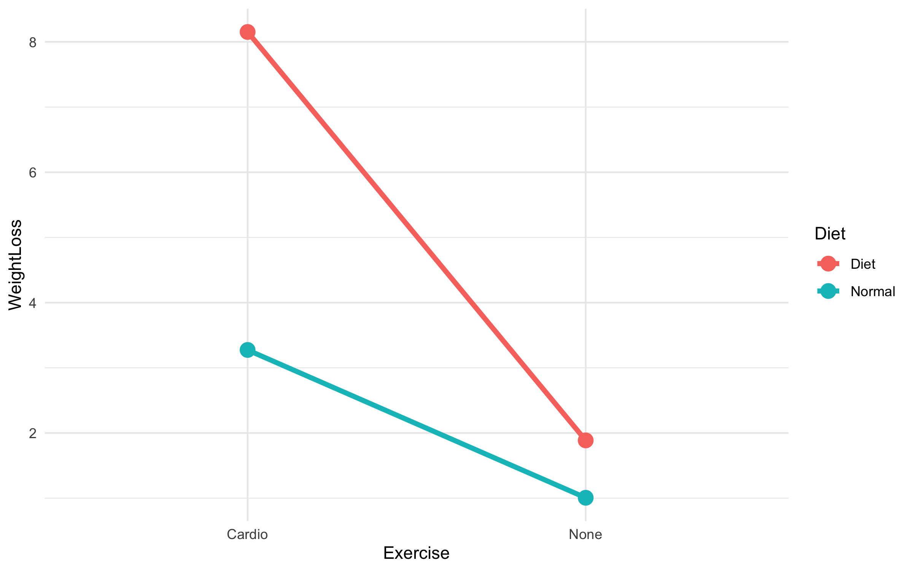

#  [Lecture Note] 이원배치 분산분석(Two-Way ANOVA)과 상호작용 가이드

## 👨‍🏫 1. [Stat Professor] 주효과와 상호작용효과(Interaction Effect)
독립변수가 2개 주어졌을 때 데이터의 분산을 쪼개는 예술입니다.
* **주효과(Main Effect)**: 오로지 '운동 여부'라는 변수가 체중 감량에 미치는 단독 파급력
* **상호작용효과(Interaction)**: "식이요법과 유산소 운동을 '동시에' 병행했을 때 효과가 곱연산으로 폭등하는가?"와 같은 두 독립 변수 간의 시너지/상쇄 효과를 검증하는 것.

## 🎨 2. [R Visualizer] Interaction Plot 선의 교차
아래 그래프에서 두 선의 기울기가 평행하다면 상호작용이 없는 것이고, **가파르게 꺾여 교차하거나 이질적인 기울기**를 보인다면 명백한 결합 시너지(상호작용)가 존재하는 것입니다.


##  3. [R Explainer] `*` 부호의 마법
```r
mod <- aov(WeightLoss ~ Diet * Exercise, data = df)
```
** 해설**: `Diet + Exercise` 로 코딩하면 상호작용을 무시하고 각 변수의 순수 파워(주효과)만 보겠다는 멍청한 코드입니다. 하지만 곱하기 기호 `Diet * Exercise`를 쓰면 내부적으로 `주효과1 + 주효과2 + 상호작용효과` 셋을 모두 자동 계산하여 통계표에 떨궈줍니다.

##  4. [Quiz Maker] 실전 복습 퀴즈
**Q. Interaction Plot을 그렸더니 두 그룹을 의미하는 선 2개가 완벽하게 나란히 평행을 유지하고 있습니다. 올바른 해석은 무엇입니까?**
1) 두 변수간의 상호작용(시너지 효과)이 매우 뚜렷하게 관찰된다.
2) 상호작용 효과가 존재하지 않으며, 각 변수의 주효과만 따로 작용하고 있다.
3) 분석을 잘못 돌렸으므로 그래프를 역전시켜야 한다.

> ** 정답: 2번**
> * 해설: 상호작용이 일어난다면 특정 범주 조건일 때 기울기가 드라마틱하게 상승/하락해야 합니다. 평행선이라는 것은 어떤 베이스라인에서도 일정하게 효과가 가산됨을 뜻하죠.
