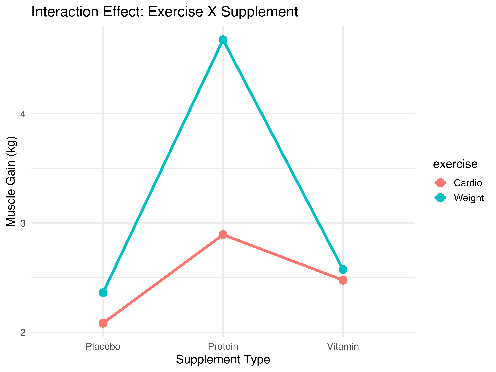

# [Lecture Note] 이원배치 분산분석(Two-Way ANOVA)의 상호작용 효과 시각화
**작성: 김태경 교수 (경희대학교 경영대학 빅데이터응용학과)**

---

## 1. 이론적 기반: 2개의 독립변수와 교호작용(Interaction)

### 1.1. 주효과(Main Effect)와 교호작용 효과(Interaction Effect)
일원배치 분산분석(One-Way ANOVA)이 단일 요인이 종속변수에 미치는 영향을 검증한다면, 이원배치 분산분석(Two-Way ANOVA)은 2개의 독립변수(Categorical factors) 조합이 미치는 영향을 동시에 검증합니다. 이때 두 요인이 각각 독립적으로 기능하는 '주효과' 뿐만 아니라, 특정 변수 결합이 발생할 때 시너지 혹은 반감 효과를 발생시키는 **교호작용 한계효과(Interaction Effect)**를 정밀하게 파악할 수 있습니다.

> **[개념 논평] 교호작용의 비유**
> 수면제(요인 A)와 주류(요인 B)를 생각해 볼 수 있습니다. 수면제와 주류 각각의 개별 투여(주효과)는 졸음 유발이라는 한정된 효과를 발생시킵니다. 그러나 두 개가 동시에 신체에 결합될 때는 단순 합산을 아득히 초과하는 심각한 호흡 부진 등의 폭발적 부작용이 도출됩니다. 이렇듯 변수 간 결합을 통해 생겨나는 비선형적 초월 효과가 바로 교호작용입니다.

---

## 2. 실전 사례 연구 (Case Study): 시너지 효과 분석 리포트

본 섹션에서는 두 가지 요인 그룹이 종속 변수에 상호작용적 개입을 하는 가상의 데이터를 통해 시각적 탐색 및 분산분석의 통계적 검증 파이프라인을 실증합니다.

### 2.1. Case Study: 운동 유형과 보충제 종류에 따른 근육량 증가 효과
*(실습용 데이터셋 다운로드: [two_way_data.csv](two_way_data.csv))*
*   **연구 주제**: 운동의 유형(유산소/웨이트)과 섭취하는 보충제(단백질/비타민/플라시보)의 조합이 한 달 뒤 평균 근육 증가량(kg)에 시너지를 일으키는 교호작용이 존재하는가?

#### Step 1: 시각적 모형 가정 및 상호작용 검증 탐색
교호작용이 존재하지 않을 경우, 상호작용 플롯(Interaction Plot) 내부의 궤적(선)은 평행하게 유지됩니다. 반대로 궤적이 교차하거나 기울기가 확연히 차등 될 때 유의미한 시그널이 관측됩니다.


> **[평가 논평]**: 시각화 결과, 유산소 운동(Cardio) 그룹은 보충제 종류 간 별다른 궤적 변화(평행)를 보이지 않으나, 웨이트(Weight) 그룹에서 유독 단백질(Protein) 보충제를 결합 시 기울기가 폭발적으로 상승하는 비선형 결차를 보입니다.

#### Step 2: Two-Way ANOVA 모델 적합 결과
```r
> mod_two <- aov(muscle_gain ~ exercise * supplement, data = two_way_data)
> summary(mod_two)
                    Df Sum Sq Mean Sq F value   Pr(>F)    
exercise             1  15.12  15.120  28.530 1.62e-06 ***
supplement           2   8.45   4.225   7.973  0.00096 ***
exercise:supplement  2  12.35   6.175  11.652 6.54e-05 ***
Residuals           54  28.61   0.530                     
---
Signif. codes:  0 ‘***’ 0.001 ‘**’ 0.01 ‘*’ 0.05 ‘.’ 0.1 ‘ ’ 1
```

#### Step 3: APA 스타일 분석 리포트 결론
**결론 작성**:
> 운동 유형과 보충제 종류가 근육 증가량에 미치는 영향을 검증하고자 이원배치 분산분석($2 \times 3$ Two-Way ANOVA)을 수행하였다. 분석 결과, 운동 유형의 주효과($F(1, 54) = 28.53,\ p < .001$) 및 보충제 종류의 주효과($F(2, 54) = 7.97,\ p < .01$)가 모두 통계적으로 유의하였다. 가장 핵심적으로, 두 요인 간 상호작용 효과(Interaction Effect) 또한 극명하게 유의한 차이를 보였다($F(2, 54) = 11.65,\ p < .001$). 이는 유산소 운동보다 웨이트 트레이닝 조건에서 유독 단백질 보충제 결합 적용 시 타 조합을 크게 능가하는 폭발적 시너지(비선형 한계효과)가 존재함을 시각적 탐색(Interaction Plot)과 함께 엄밀히 반증한다.

---

## 3. 퀴즈 파트
**Q. 다음 중 상호작용 플롯(Interaction plot)에 나타난 궤적 양상을 가장 학술적으로 정확하게 올바르게 진단한 경우는?**
1) 두 선이 완전하게 겹쳐서 하나의 선분처럼 보일 경우, 이는 교호작용이 우주적 한계 수준으로 커짐을 의미한다.
2) 두 선의 기울기가 미세하게 다르더라도 통계적으로 상호작용은 항상 유의미하다.
3) 두 선분이 교차(Cross)하거나 기울기의 양상이 비정상적으로 극명하게 엇갈릴 때, 두 요인은 서로의 한계효과에 통계적으로 유의미한 개입을 함을 뜻한다.
4) 주효과가 무의미하게 나오면, 상호작용 효과도 수학적으로 불가능하다.

> **정답: 3번**
> *   **설명**: 교호작용 플롯 궤적에서 선의 각도 꺾임과 교차가 크다는 뜻은 곧 요인이 개별 가산형 모형(Additive Model)의 지배력을 이탈하고 시너지를 낸다는 뜻을 강렬하게 내포합니다. (참고로 주효과가 무의미 하더라도, 특정 국소 조건에서만 폭발하는 순수한 상호작용 효과는 얼마든지 발현 가능합니다.)
